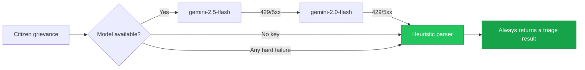
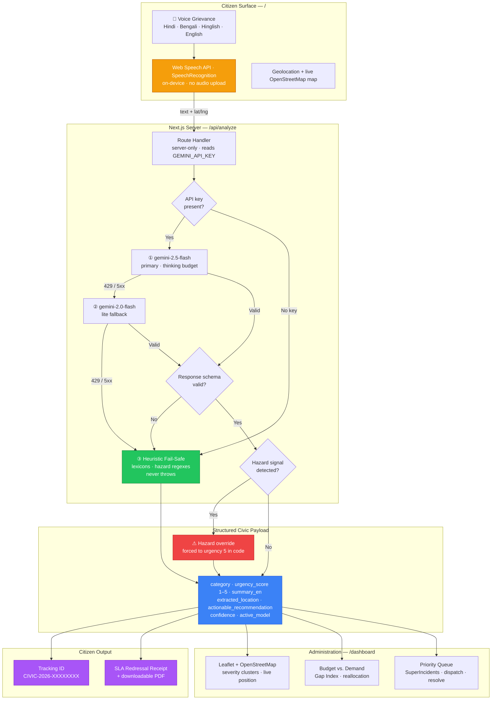

<div align="center">

# CivicLens

### AI for Digital Public Infrastructure & Governance

**A voice-first, multilingual civic grievance platform that turns a spoken complaint in any language into a triaged, geo-tagged, SLA-bound dispatch instruction for municipal administrators — in seconds, and with zero infrastructure cost.**

[](https://nextjs.org)
[](https://react.dev)
[](https://www.typescriptlang.org)
[](https://tailwindcss.com)
[](https://ai.google.dev)
[](https://leafletjs.com)
[](https://www.openstreetmap.org/copyright)
[](https://vercel.com)
[](https://github.com/mahmudul-hasan-hasib/Civic-AI)
[]()

<br>

| | |
|---|---|
| **Track** | Track 01 — AI for Digital Public Infrastructure & Governance |
| **Event** | Build with AI: Code for Communities Hackathon (2026) |
| **Live Demo** | **[civic-ai-umber.vercel.app](https://civic-ai-umber.vercel.app)** |
| **Repository** | **[github.com/mahmudul-hasan-hasib/Civic-AI](https://github.com/mahmudul-hasan-hasib/Civic-AI)** |
| **Author** | [Mahmudul Hasan Hasib](https://github.com/mahmudul-hasan-hasib) |
| **External APIs** | **None required to run.** Every paid dependency is optional and degrades gracefully. |
| **Cost to deploy** | Free tier. Serverless functions, no database, no map vendor, no key registry. |

</div>

---

## Table of Contents

1. [Problem Statement](#1-problem-statement)
2. [Solution Overview](#2-solution-overview)
3. [Key Features & Innovations](#3-key-features--innovations)
4. [Tech Stack](#4-tech-stack)
5. [System Architecture](#5-system-architecture)
6. [The AI Pipeline in Detail](#6-the-ai-pipeline-in-detail)
7. [Local Setup & Environment Variables](#7-local-setup--environment-variables)
8. [Security, Data Privacy & Responsible AI](#8-security-data-privacy--responsible-ai)
9. [Author & Acknowledgements](#9-author--acknowledgements)

---

## 1. Problem Statement

Municipal grievance redressal across South Asia fails at three systemic choke points. They compound: each one degrades the data that the next one depends on.

### 1.1 The linguistic and literacy barrier

A conventional complaint portal is a written form in the official language. For a large share of the population — the elderly, women in low-literacy households, daily-wage workers, and anyone more comfortable speaking than typing in English or the regional administrative language — **the portal is functionally unusable.**

The result is not that these citizens are ignored. It is worse than that: **the people with the most acute infrastructure needs are systematically under-represented in the complaint data**, because the only channel they can reach is the phone call, the neighbour, or the neighbourhood agent. A flood complaint never reaches the municipal system. It becomes a rumour.

> The portal collects complaints from citizens who can already file complaints. That selection bias is the core failure.

### 1.2 Manual triage as a latency bottleneck

When a complaint *does* arrive — by phone or on paper — it enters a human queue. A municipal control room reads it, decides which department owns it, decides how urgent it is, and forwards it.

For a **water-main burst** or an **exposed live wire**, that queue is the hazard. The difference between a hazard being triaged in four minutes and in four hours is frequently the difference between a property-damage incident and a fatality. Manual triage introduces latency precisely where latency is most expensive, and it does so non-deterministically: two operators will score the same complaint differently, and neither leaves a record of why.

### 1.3 The data-policy disconnect

This is the most expensive failure, because it is invisible.

Municipal budgets and ward capital expenditure are planned from **historical allocations, political negotiation, and central directives** — not from measured, current, geographic demand. Concretely, a ward may be allocating 12% of its capital budget to drainage while 41% of its residents are reporting drainage failures. **The city does not know this**, because the evidence arrives as unstructured, untranslated, un-geocoded, un-prioritised text through a channel no planning system reads.

The result is a compounding misallocation: funds go where they went last year, complaints go where the budget is not, and the gap widens every cycle. The single highest-leverage intervention is therefore not a better complaint form. It is **turning the vernacular complaint stream into a structured, geo-tagged, time-stamped, categorised demand signal that a budget committee can actually read.**

---

## 2. Solution Overview

**CivicLens is a voice-first, multilingual Digital Public Infrastructure layer that sits between vernacular citizens and municipal administrations.**

A citizen opens the app, presses one button, and speaks their grievance in Hindi, Bengali, Hinglish, or English — romanised, misspelt, and colloquial, exactly as people actually talk. The platform transcribes on-device, translates, classifies, scores urgency on a calibrated 1–5 scale, extracts the location, and generates a specific, actionable dispatch instruction. The citizen receives a tracking ID and an SLA-bound redressal receipt they can download as a PDF. The administrator sees the same signal, instantly, as a severity-coded geospatial cluster and a budget-versus-demand gap analysis.

The design premise is deliberate:

> **CivicLens is DPI, not a SaaS product.** There is no account to create, no subscription, no per-seat licence, and no vendor to procure. The citizen interface is a single button and a voice. The municipal interface is a map and a budget chart. The connective tissue is a schema. That is what makes it deployable by any municipality in the world on a free cloud tier, today, without procurement.

Three design consequences follow from that premise, and they are the spine of the whole system:

| Principle | Consequence in the codebase |
|---|---|
| **The last mile cannot be monetised or gated.** | Voice capture uses the browser-native Web Speech API. There is no STT vendor, no per-minute cost, and no audio leaving the device. |
| **A public service must not go dark when a vendor is down.** | The AI path has a two-model cascade *and* a rule-based offline parser. The citizen **always** gets a triage result. |
| **Geospatial evidence must be free and permanent.** | Maps use the OpenStreetMap standard tile layer — public, keyless, and un-gateable. No Mapbox, Stadia, or Jawg, all of which demand a token and render a black "API KEY REQUIRED" tile without one. |

---

## 3. Key Features & Innovations

### 3.1 Zero-cost, browser-native voice intake

Intake is built on the **Web Speech API** (`SpeechRecognition` / `webkitSpeechRecognition`) — no server-side audio pipeline, no speech-to-text vendor, no per-minute billing.

- **Audio never leaves the device.** Transcription happens in the browser and only the resulting *text* is sent to the server. See [§8](#8-security-data-privacy--responsible-ai).
- **Graceful capability detection.** The API is feature-detected via the vendor-prefixed fallback, with an explicit unsupported-state message and a keyboard path, rather than a silent failure.
- **A voice waveform** driven by the `AnalyserNode` graph gives live feedback that the microphone is genuinely being sampled.

### 3.2 Automated AI triage under a strict structured schema

The `/api/analyze` route calls the **Google GenAI SDK** and requires a validated, typed JSON object back. The model is not permitted to return prose.

| Output field | Purpose |
|---|---|
| `category` | One of five canonical municipal service categories |
| `urgency_score` | Integer **1–5**, against a calibrated rubric |
| `summary_en` | Plain-English summary for the officer queue |
| `extracted_location` | Ward / landmark extracted from the utterance |
| `actionable_recommendation` | Concrete dispatch instruction, not a category label |
| `confidence` | Calibrated against the tier that answered |
| `active_model` | Which tier actually served the request — audited, not guessed |

Two safety layers wrap the model's own judgement:

- **Schema validation.** A response missing keys or carrying a non-numeric urgency is a hard failure that advances the cascade, rather than a malformed record entering the dispatch queue.
- **Hazard override.** A deterministic check runs *after* the model returns. Any electrical-sparking, live-wire, or gas hazard signal is forced to `urgency_score = 5` and to the hazardous-infrastructure category. **The model can under-report urgency; the code cannot.** Life-safety classification is not left to a probabilistic system.

### 3.3 Dual-layer resilience cascade

A public grievance system is used precisely when things go wrong. If the AI provider is rate-limiting or down — the exact moment demand spikes — a fragile system returns an error to a citizen reporting a live wire.

CivicLens therefore degrades in **two layers**:



- **Layer 1 — model cascade.** `gemini-2.5-flash` (primary, supports a thinking budget) → `gemini-2.0-flash` (lite tier). HTTP `429`, `500`, `502`, `503`, `504` are classified as *retryable*, meaning "advance the cascade", rather than "the citizen's input is bad". Non-retryable faults and malformed structured output also advance the cascade, with the reason logged and returned in `active_model`.
- **Layer 2 — heuristic fail-safe.** A rule-based parser — category lexicons, location patterns, and hazard regexes — reconstructs a complete, dispatchable payload. It runs when the cascade is exhausted, when `GEMINI_API_KEY` is absent, and on empty input. It **never throws.** The result carries `active_model: "heuristic-fail-safe"` and a deliberately depressed confidence band (`0.70–0.78`) so downstream consumers can tell a degraded answer from a model-served one.

> The architectural guarantee: **`/api/analyze` always returns HTTP 200 with a usable payload.** A citizen filing a complaint during a provider outage gets a tracking ID and an SLA, not a stack trace.

### 3.4 Geospatial command map on free, keyless OpenStreetMap tiles

An interactive **Leaflet** map plots severity-coded incidents against a live basemap, with the citizen's own device position drawn in a distinct shape and colour so the two are never confused.

The tile layer is a single explicit constant — `https://tile.openstreetmap.org/{z}/{x}/{y}.png` — with no fallback chain that could quietly reintroduce a keyed provider. Reports are clustered by **haversine distance** (500 m radius) into `SuperIncident` objects, so twenty reports on one collapsed street become one actionable incident with a boosted severity, not twenty separate rows.

Because a black rectangle is the most common and least diagnosable failure mode of Leaflet in production, the map handles it explicitly: a themed container background shows through before tiles arrive, `tileerror` is counted, and sustained failure raises an in-place message that names the **actual** cause — *"network or tile-server issue, not a missing API key"* — with a working retry. Leaflet is loaded with `ssr: false` and hydrated behind a client gate, so there is no SSR mismatch crash.

### 3.5 Policy analytics — the Municipal Budget vs. Citizen Demand gap

This is the feature that turns a complaint system into a governance instrument.

For every ward, CivicLens computes each category's **share of live citizen demand** and compares it against its **share of the allocated capital budget**. The difference is the `deficitPct`. An aggregate **Gap Index** (`0–100`, where `100` is total misalignment) summarises the ward's exposure, and any category exceeding a 20-point deficit is surfaced as a named mismatch.

| | |
|---|---|
| **Demand** | Measured from live geo-tagged complaints, per category, per ward. |
| **Budget** | Baseline allocation share, against a ₹50,00,000 ward revenue pool. |
| **Gap Index** | `100 − Σ min(demand%, budget%)`, floored at `0`. |
| **Action** | Surfaces ranked reallocation candidates and the shift amount that would close them. |

An administrator can therefore open the dashboard, see that drainage demand in a ward is running 29 points above its budget share, and export a briefing PDF. **The citizen's complaint has become a line item in a budget decision.**

### 3.6 Citizen-facing transparency

- **SLA-bound receipt.** Urgency determines a hard resolution window — see the matrix in [§6](#6-the-ai-pipeline-in-detail). The receipt states the window explicitly, so the commitment is visible to the citizen.
- **Downloadable PDF receipt** (`jsPDF`), plus a reference hash for disputing the record.
- **Human-readable tracking ID** — `CIVIC-2026-` plus an 8-character base32 code from an alphabet that deliberately excludes `I`, `O`, `0`, and `1` so it survives being read aloud or copied off a printed receipt.
- **Zero-friction state.** Reports, dispatches, and resolutions persist to `localStorage` and degrade to an in-memory store when storage is unavailable, so the app never hard-fails on a locked-down browser.

---

## 4. Tech Stack

| Layer | Technology | Version | Rationale |
|---|---|---|---|
| **Framework** | Next.js (App Router) | `16.3.6` | Route Handlers give a single server boundary where the API key lives and the AI orchestration runs. Static export + serverless functions = free-tier deployment. |
| **UI Runtime** | React | `19.2.8` | Server/Client Component boundary keeps the citizen surface as light JS. |
| **Language** | TypeScript | `5` | The triage payload is a contract between an LLM and a dispatch system. `strict` typing is the only thing standing between a hallucinated field and a misrouted emergency. |
| **Styling** | Tailwind CSS | `4` | Design tokens and responsive layout without a CSS-in-JS runtime cost. |
| **Icons** | Lucide React | `1.48` | Tree-shakeable, consistent icon set. |
| **AI Orchestration** | Google GenAI SDK (`@google/genai`) | `2.24.0` | Structured JSON output with a response schema, plus explicit HTTP status surfacing needed for the cascade. |
| **AI Models** | `gemini-2.5-flash` → `gemini-2.0-flash` | — | Two live tiers: a primary with a thinking budget, and a lite fallback with a smaller quota footprint. |
| **Geospatial** | Leaflet + React-Leaflet | `1.9.4` / `5.0.0` | Mature, framework-agnostic, and free. |
| **Basemap** | OpenStreetMap standard tiles | — | Public, keyless, no vendor lock-in. Attribution is rendered and compliant. |
| **PDF Generation** | jsPDF | `4.2.1` | Client-side receipt and briefing generation — no server, no cost. |
| **State** | `useSyncExternalStore` + `localStorage` | — | A tiny external store with cached snapshots. No Redux, no context waterfall, and hydration-safe by construction. |
| **Hosting** | Vercel | — | Free tier covers this workload entirely. |
| **Validation** | ESLint (`eslint-config-next`) | `9` / `16.3.6` | React Compiler-aware rules; the build gate for this project. |

**Deliberately absent:** no database, no ORM, no auth provider, no state-management library, no map vendor, no speech-to-text vendor, no UI kit, no CSS framework beyond Tailwind. Every omission is a cost a municipality would otherwise have to pay.

---

## 5. System Architecture



### ASCII view

```
   CITIZEN (vernacular, voice-first)                MUNICIPAL ADMINISTRATION
   ════════════════════════════════                 ════════════════════════
   ┌─────────────────────────────┐                  ┌──────────────────────┐
   │  🎤 "bijli ka taar khula   │                  │  🗺️  Leaflet + OSM    │
   │     hai gali mein"          │                  │      severity map    │
   │      (Hinglish, romanised)  │                  ├──────────────────────┤
   └──────────────┬──────────────┘                  │  📊 Budget vs Demand │
                  │                                 │      Gap Index       │
                  ▼                                 ├──────────────────────┤
   ┌─────────────────────────────┐                  │  🚨 Priority Queue   │
   │  Web Speech API             │                  │      SuperIncidents  │
   │  SpeechRecognition          │                  └──────────┬───────────┘
   │  ⚡ ON-DEVICE. No audio     │                             │
   │     ever leaves the phone   │                             │
   └──────────────┬──────────────┘                             │
                  │  text + lat/lng                             │
                  ▼                                             │
   ┌──────────────────────────────────────────┐                 │
   │        Next.js Server  /api/analyze      │                 │
   │  ┌────────────────────────────────────┐  │                 │
   │  │ 🔑 GEMINI_API_KEY read server-side │  │                 │
   │  └──────────────┬─────────────────────┘  │                 │
   │                 ▼                        │                 │
   │   ┌─────────────────────────────┐        │                 │
   │   │ ① gemini-2.5-flash          │──fail──┼──┐              │
   │   └──────────────┬──────────────┘        │  │              │
   │                  ▼                       │  ▼              │
   │   ┌─────────────────────────────┐   ┌────┴──────────┐      │
   │   │ ② gemini-2.0-flash          │   │ Schema +      │      │
   │   └──────────────┬──────────────┘   │ hazard guard  │      │
   │                  │ fail             └────┬──────────┘      │
   │                  ▼                       │                 │
   │   ┌─────────────────────────────┐   ┌────▼──────────┐      │
   │   │ ③ HEURISTIC FAIL-SAFE       │◄──┤ Always returns│      │
   │   │    lexicons + regexes      │   │ HTTP 200      │      │
   │   │    NEVER THROWS            │   └────┬──────────┘      │
   │   └──────────────┬──────────────┘        │                 │
   └──────────────────┼───────────────────────┼─────────────────┘
                      ▼                       ▼
            ┌───────────────────────────────────────┐
            │   📦  STRUCTURED CIVIC PAYLOAD          │
            │   category · urgency_score (1–5)        │
            │   summary_en · extracted_location       │
            │   actionable_recommendation             │
            │   confidence · active_model             │
            └───────────────┬───────────────────────┘
                            │
          ┌─────────────────┴──────────────────┐
          ▼                                    ▼
   ┌──────────────────────┐          ┌────────────────────────┐
   │ 🧾 SLA RECEIPT       │          │ 🗺️ MAP + BUDGET DASHBOARD│
   │  CIVIC-2026-XXXXXXXX │          │  clusters · Gap Index    │
   │  + PDF download      │          │  dispatch · resolve     │
   └──────────────────────┘          └────────────────────────┘
```

### Repository layout

```
civic-ai/
├── src/
│   ├── app/
│   │   ├── api/analyze/route.ts   # ★ AI cascade, schema, heuristic fail-safe
│   │   ├── civic-shared.ts        # ★ Domain model: categories, SLA, wards,
│   │   │                          #   budget allocation, haversine clustering
│   │   ├── page.tsx               # Citizen surface: voice intake + receipt
│   │   ├── dashboard/page.tsx     # Administration surface
│   │   ├── layout.tsx             # Root layout + font/theme wiring
│   │   └── globals.css            # Design tokens, keyframes, reduced-motion
│   ├── components/
│   │   ├── RealGrievanceHeatmap.tsx  # ★ Leaflet + OSM command map
│   │   ├── CivicMap.tsx            # Citizen-side map with live position
│   │   ├── ReceiptCard.tsx         # SLA redressal receipt
│   │   ├── admin/
│   │   │   ├── GeospatialPanel.tsx  # Heatmap panel + shared timeframe
│   │   │   ├── PolicyAnalytics.tsx  # ★ Budget vs. Demand Gap Index
│   │   │   ├── PriorityQueue.tsx    # SuperIncident dispatch queue
│   │   │   ├── RecentTickets.tsx    # Ticket log with expand/collapse
│   │   │   ├── MetricCards.tsx      # Click-to-scope filters
│   │   │   └── Primitives.tsx       # AdminPanel, FilterPill, legends
│   │   ├── NotificationBell.tsx  # Unread officer notifications
│   │   └── ...                   # AmbientCanvas, AshokaChakra, ThemeToggle
│   ├── context/AuthContext.tsx   # Authority gate (demo-level)
│   └── lib/
│       ├── civic-store.ts        # ★ External store, localStorage + memory fallback
│       ├── receipt-pdf.ts        # Citizen SLA receipt PDF
│       └── briefing-pdf.ts       # Officer briefing PDF
├── .env.local          # GEMINI_API_KEY  (git-ignored)
└── package.json
```

★ = load-bearing files; most of the engineering judgement lives in these.

---

## 6. The AI Pipeline in Detail

### 6.1 The triage rubric

Urgency is the output the whole governance layer depends on, so it is a calibrated integer on a fixed scale, not a free-floating score. The model is instructed with a strict rubric, and the same thresholds are mirrored in the heuristic parser so both paths produce comparable results.

| Score | Band | Typical signals | Resolution SLA |
|---|---|---|---|
| **5** | Critical — threat to life | Sparking equipment, exposed/live wiring, gas leak, structural collapse, electrocution risk | **2 hours** |
| **4** | High — major disruption | Burst main, sustained power outage, water supply failure | **24 hours** |
| **3** | Elevated — chronic service failure | Potholes, waste accumulation, unlit streets, drainage blockage | **48 hours** |
| **2** | Routine service request | Repainting, minor pothole, routine sanitation | **120 hours** |
| **1** | Informational | Enquiries, suggestions, compliments | **120 hours** |

The **hazard override** is what makes row 1 trustworthy. Sparking electrical equipment, electrocution risk, and live wires are forced to `5` *after* the model responds, by deterministic code. A model that under-scores a fatal hazard is corrected; a model that over-scores is left alone. **The asymmetry is deliberate** — in public safety, a false positive costs a wasted inspection, while a false negative costs a life.

### 6.2 Structured output contract

The model is bound to a response schema and the result is validated field-by-field before it is trusted:

```ts
{
  category: "Roads & Transport" | "Water Supply" | "Drainage"
         | "Electricity" | "Sanitation / Civic Maintenance",
  urgency_score: number,                       // integer 1–5, clamped
  summary_en: string,                          // plain English for the officer
  extracted_location: string,                  // ward / landmark
  actionable_recommendation: string,           // dispatch instruction
  confidence: number,                          // 0–1, tier-calibrated
  active_model: "gemini-2.5-flash" | "gemini-2.0-flash" | "heuristic-fail-safe"
}
```

`active_model` is the audit trail. When a complaint is scored by the heuristic fail-safe rather than a model, the dashboard and the receipt both say so. A degraded answer is never presented as a confident one.

> **Note on the cascade depth.** The architecture is an ordered list and supports N tiers. It currently ships with **two** live Gemini tiers. `gemini-1.5-flash` was considered as a third tier and deliberately excluded: the 1.5 family is retired by Google, so it would add a guaranteed-failing network hop to every degraded request without ever being able to serve one. Two live tiers plus a total-outage fail-safe is faster *and* more reliable than three tiers where one is dead.

### 6.3 What the citizen receives

An SLA-bound receipt is generated immediately and is downloadable as a PDF. The commitment shown is the same one the dashboard enforces — urgency 5 means 2 hours on both surfaces, and on the PDF. A citizen can therefore hold the institution to the number the AI gave them, and the reference hash lets them dispute the record.

---

## 7. Local Setup & Environment Variables

### Prerequisites

| Requirement | Version |
|---|---|
| Node.js | **20.x** or newer (developed on 24.x) |
| npm | 10 or newer |
| A modern browser | Chrome or Edge recommended — `SpeechRecognition` support is uneven in Firefox and Safari |

### Step 1 — Clone

```bash
git clone https://github.com/mahmudul-hasan-hasib/Civic-AI.git
cd Civic-AI
```

### Step 2 — Install dependencies

```bash
npm install
```

### Step 3 — Configure the environment

The only environment variable is **optional**. The app runs fully without it — the heuristic fail-safe engages automatically.

```bash
# Create the local environment file
touch .env.local      # macOS / Linux
# copy .env.local .env.example  then edit, on Windows
```

Add your key:

```bash
# .env.local
GEMINI_API_KEY=your_google_gemini_api_key_here
```

Get a key from [Google AI Studio](https://aistudio.google.com/apikey) (the free tier is more than sufficient for this workload).

| Variable | Required | Default | Purpose |
|---|---|---|---|
| `GEMINI_API_KEY` | **No** | — | Enables live Gemini triage. If absent or invalid, CivicLens transparently runs the heuristic fail-safe and labels every result accordingly. |

> `.env.local` is git-ignored. **The key is read only inside the Route Handler on the server and is never exposed to the client bundle.** Verify this any time with `grep -r "GEMINI_API_KEY" .next/static` — it returns nothing.

### Step 4 — Run the development server

```bash
npm run dev
```

Open **[http://localhost:3000](http://localhost:3000)** for the citizen surface, and **[http://localhost:3000/dashboard](http://localhost:3000/dashboard)** for the administration console.

### Step 5 — Verify the build

```bash
npx tsc --noEmit     # type-check
npm run lint         # ESLint
npm run build        # production build
```

### Production

```bash
npm run build
npm start
```

### Troubleshooting

| Symptom | Cause | Fix |
|---|---|---|
| `active_model` reads `heuristic-fail-safe` | No key, invalid key, quota exhausted, or provider outage | Check `.env.local`; the console logs the exact reason. The app is working correctly. |
| "Loading real-time geospatial map..." never resolves | Leaflet chunk failed to load | Hard-reload; check for a blocked CDN or ad-blocker. |
| Basemap tiles are blank/grey | Tile request blocked | CivicLens reports this in place and offers a retry. It is a network issue, not a missing API key — OSM tiles need no credentials. |
| Voice input unavailable | `SpeechRecognition` unsupported in this browser | Use Chrome or Edge. The text-input path remains fully functional. |
| `localStorage` errors | Private mode / storage blocked | CivicLens falls back to an in-memory store automatically. |

---

## 8. Security, Data Privacy & Responsible AI

CivicLens handles emergency infrastructure complaints from people in distress. Privacy and safety are treated as architectural requirements, not policy documents.

### 8.1 The API key never reaches the browser

- `GEMINI_API_KEY` is read **only** inside `src/app/api/analyze/route.ts`, a server-side Route Handler.
- The variable is never prefixed with `NEXT_PUBLIC_`, so Next.js excludes it from the client bundle.
- The Gemini client is constructed inside the handler, per request. There is no long-lived credential on any edge or middleware path.
- **Auditable in one command:** `grep -r "GEMINI_API_KEY" .next/static` must return zero matches.

### 8.2 Audio is ephemeral and never stored

This is the most important privacy property in the system.

- Transcription uses the **browser-native `SpeechRecognition` API**. Audio is processed by the browser engine and **never uploaded to a CivicLens server** — there is no audio endpoint, and no audio storage exists anywhere in the codebase.
- Only the resulting **text** is transmitted, and only to `/api/analyze`.
- The microphone stream is released on completion. No recording is buffered, cached, or persisted.
- Citizen-side state (`localStorage`) holds *derived civic records* — category, urgency, location, tracking ID — never raw audio.

### 8.3 Data minimisation and local-first persistence

- No account, email, phone number, or government ID is required to file a grievance. The system is usable anonymously, because a barrier to reporting is itself a public-safety failure.
- Citizen state persists to `localStorage` under scoped keys (`civiclens-reports`, `civiclens-dispatched`, `civiclens-resolved`, `civiclens-telemetry`) and is **readable only by the citizen who created it**. It is not transmitted to any third party.
- When storage is unavailable — locked-down or private-browsing contexts — the store transparently falls back to memory. The app degrades, it does not crash.
- The deployment is a static export plus serverless functions, with **no third-party analytics, no session recording, and no advertising SDK**. MAU is zero by design, not by policy.
- Map tiles are requested from the public OpenStreetMap tile servers, which necessarily see the tile coordinates requested — the standard, disclosed behaviour of any slippy map. This is documented in the rendered tile attribution.

### 8.4 Fail-safe, not fail-open

When the AI layer is unavailable, CivicLens **degrades to a lower-confidence answer rather than refusing the citizen.** A person reporting an exposed wire must never be told "service unavailable".

- The heuristic path is deterministic, auditable, and cannot throw.
- Its output is labelled `active_model: "heuristic-fail-safe"` and carries a depressed confidence band (`0.70–0.78`), so downstream surfaces can distinguish a degraded result from a model-served one.
- The citizen still receives a tracking ID and an SLA.

### 8.5 Responsible AI commitments

| Commitment | Implementation |
|---|---|
| **Human authority is preserved.** | The AI recommends; the officer dispatches. There is a human action on every escalation path. |
| **Life-safety classification is deterministic.** | The hazard override forces urgency `5` in code, after the model responds. Probabilistic output cannot downgrade a fatal hazard. |
| **Over-triage is preferred to under-triage.** | The override is one-directional by design. A false positive costs an inspection; a false negative can cost a life. |
| **The model cannot emit unvalidated data.** | Strict schema validation gates every field. Invalid output advances the cascade rather than reaching a dispatch queue. |
| **Every AI answer is attributable.** | `active_model` and `confidence` travel with the payload and surface in the dashboard. |
| **No synthetic citizen is presented as real.** | The seeded demo dataset used to populate the dashboard is clearly separated from reports actually filed. |
| **Demographic bias is monitored, not assumed away.** | Multilingual, romanised, and misspelt input is a first-class case. The rubric was validated against vernacular utterances, not clean English. |

### 8.6 Known limitations, stated plainly

- `SpeechRecognition` support is uneven across browsers; Chrome and Edge are the reference targets. This is a platform limitation, not a design choice.
- The authority gate is **demonstration-level**. It is not an identity system and must not be treated as access control.
- Urgency scoring is calibrated against municipal service categories defined in `civic-shared.ts`. A different city must recalibrate the rubric and budget baselines — and that recalibration is data work, not code work.
- The seeded dataset is synthetic. The Gap Index is only as meaningful as the real demand data behind it.

---

## 9. Author & Acknowledgements

### Author

<div align="center">

**Mahmudul Hasan Hasib**

[](https://github.com/mahmudul-hasan-hasib)
[](https://github.com/mahmudul-hasan-hasib/Civic-AI)
[](https://civic-ai-umber.vercel.app)

</div>

### Acknowledgements

Built for the **Build with AI: Code for Communities Hackathon 2026**, Track 01 — *AI for Digital Public Infrastructure & Governance*.

This project stands on the work of other people, and it would be dishonest not to say so:

- **Google** — the Gemini API and the GenAI SDK, including the structured-output schema support that makes auditable triage possible rather than a hopeful prompt.
- **OpenStreetMap volunteers** — the map data, and the public tile infrastructure this entire geospatial layer is built on, provided free of charge and without a key. This is the quiet foundation under a large fraction of all open civic mapping.
- **Leaflet contributors** — a decade of matured, dependency-light open-source mapping.
- **The Vercel and Next.js open-source community** — the deployment and framework substrate that let a solo participant ship a production-grade DPI prototype for free.
- **The citizens whose grievances motivated this.** The premise of CivicLens is that people reporting a live wire, a burst main, or a collapsed street deserve a channel that works. That premise came first, and the technology was chosen to serve it.
- **The hackathon organisers and reviewers** — for framing the challenge in a way that asked the right question: not "what AI can we build", but "what can we build for the people the system currently fails".

---

<div align="center">

**CivicLens** — *Because a complaint nobody can file is a problem nobody can solve.*

[](https://nextjs.org)
[](https://ai.google.dev)
[](https://www.openstreetmap.org/copyright)

Track 01 · AI for Digital Public Infrastructure & Governance
Build with AI: Code for Communities Hackathon 2026

</div>
